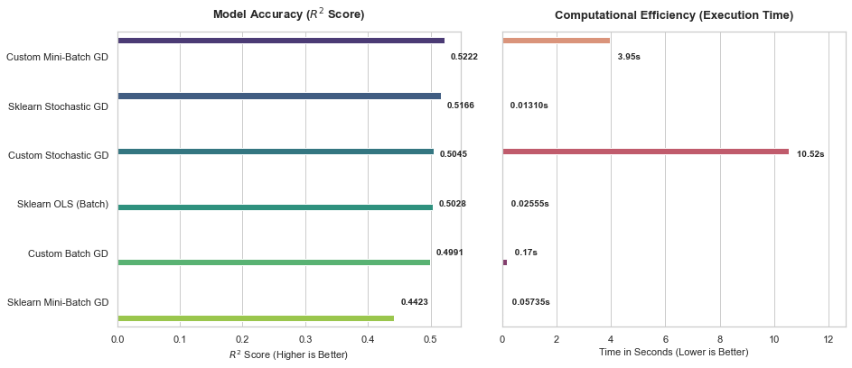
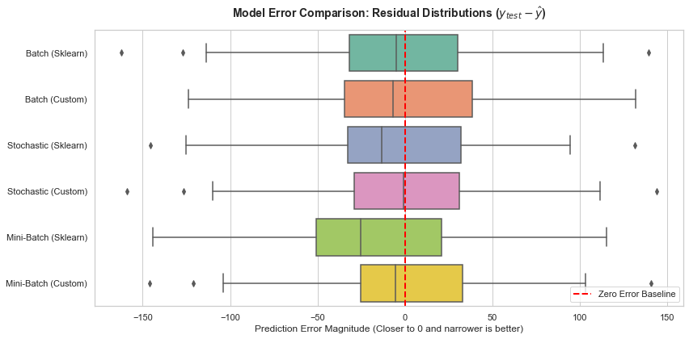

# Gradient Descent from Scratch vs Scikit-Learn

Implementing batch, stochastic, and mini-batch gradient descent from scratch in NumPy and comparing them against Scikit-Learn's solvers on the Diabetes dataset.

This is a learning project. The goal was to understand *why* gradient descent works by building it myself, not just calling `.fit()`.

---

### What I built

- `BatchGDRegressor` — updates weights using the full dataset every epoch
- `StochasticGDRegressor` — updates weights one sample at a time, shuffled each epoch
- `MiniBatchGDRegressor` — splits data into small batches, updates per batch

Each one is written in plain NumPy and paired against its Scikit-Learn equivalent.

---

### Results

All six models land in a similar R² range (0.46–0.52), which means the scratch implementations are actually learning correctly. The big difference shows up in execution time — custom SGD is ~545× slower than Sklearn's because pure Python loops over every sample are genuinely slow. Sklearn runs compiled C under the hood.

- Same math, very different speed. Writing the update loop in Python vs using a compiled solver is a 500× difference in practice.

---

### Dataset

[Diabetes dataset](https://scikit-learn.org/stable/datasets/toy_dataset.html#diabetes-dataset) from Scikit-Learn — 442 samples, 10 features, continuous target (disease progression).